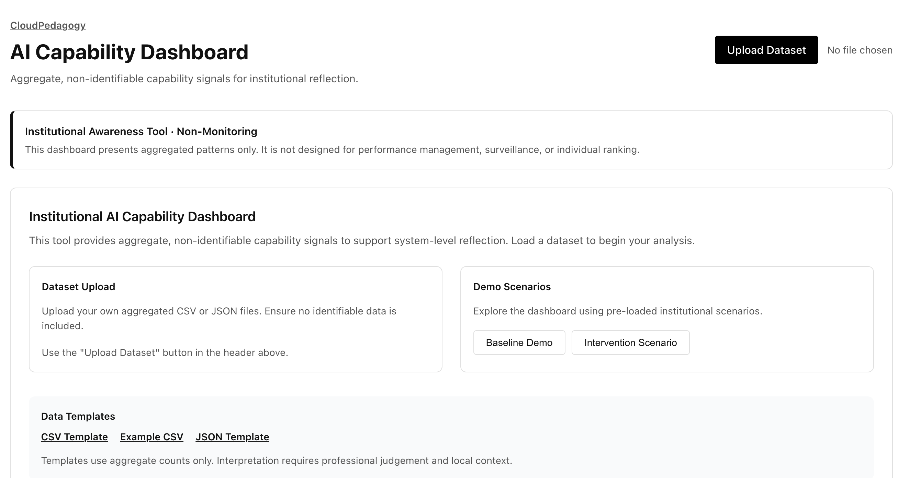

# AI Capability Dashboard

A lightweight, browser-based, **aggregate dashboard** for examining patterns and trends in AI capability over time, grounded in the **CloudPedagogy AI Capability Framework**.

## 🔗 Role in the CloudPedagogy Ecosystem

**Phase:** Phase 3 — Capability System

**Role:**
Aggregates and visualizes organizational AI capability signals to surface structural trends, maturity gaps, and longitudinal benchmarks.

**Upstream Inputs:**
Aggregate datasets or individual JSON snapshots from the **Capability Assessment Tool**.

**Downstream Outputs:**
Provides multi-dimensional insight for the **Gaps & Risk** diagnostic and strategic institutional review committees.

**Does NOT:**
- Perform granular individual performance tracking.
- Test organizational resilience against specific risk scenarios (this is for the Stress Test).


The AI Capability Signals Dashboard supports **sense-making, reflection, and governance-aligned conversation** about how AI capability is developing across an organisation — without surveillance, benchmarking, or individual assessment.

It is designed to help teams **notice patterns**, **surface tensions**, and **ask better questions**, not to measure performance or enforce compliance.

This tool is part of the **CloudPedagogy AI Capability Tools** suite.

---
## 🌐 Live Hosted Version

👉 http://cloudpedagogy-ai-capability-dashboard.s3-website.eu-west-2.amazonaws.com/

---

## 🖼️ Screenshot



---
## 🛠️ Getting Started

### Clone the repository

```bash
git clone [repository-url]
cd [repository-folder]
```

### Install dependencies

```bash
npm install
```

### Run locally

```bash
npm run dev
```

Once running, your terminal will display a local URL (often http://localhost:5173). Open this in your browser to use the application.

### Build for production

```bash
npm run build
```

The production build will be generated in the `dist/` directory and can be deployed to any static hosting service.

---

## 🔐 Privacy & Security

### Strategic Context
- **Aggregation-Only**: Designed to consolidate non-identifiable capability data from Assessment snapshots.
- **Internal Benchmarking**: Compares domains against the active dataset average to identify structural lags.
- **Gap Detection**: Visually highlights "Maturity Gaps" where specific domains underperform relative to the institution.
- **Longitudinal Insight**: Provides trajectory summaries and delta tracking across multiple periods.

---

## 📊 Strategic Evaluation Features

This dashboard has been strengthened to serve as the primary insight layer for institutional capability:

### 1. Maturity Gap Identification
The dashboard automatically identifies "Gaps" — domains where the weighted maturity index is more than **15% below the dataset average**. This allows institutions to prioritize investment where structural weakness is highest.

### 2. Dataset-Level Benchmarking
The overview chart includes a target benchmark line representing the average distribution across all domains. This provides an immediate visual baseline for internal comparison.

### 3. Trend Delta Indicators
The trends view includes numerical 🔼/🔽 indicators showing the precise shift in maturity index between the two most recent periods, categorized into **Improved** and **Regressed** trajectory summaries.
ational and governance contexts  

---

## What this application is

The AI Capability Signals Dashboard helps individuals, teams, and organisations:

- observe **aggregate patterns** in AI capability across the six framework domains  
- explore **trends over time**, rather than one-off snapshots  
- surface **imbalances or tensions** (e.g. innovation accelerating faster than governance)  
- support **leadership, governance, and strategic discussions** without performance anxiety  
- turn AI-related data into **reflection and dialogue**, not action-by-default  
- document shared understanding for committees, workshops, and reviews  

The tool is **capability-led, reflective, and interpretive**.  
It is explicitly designed to support **professional judgement**, not replace it.

---

## What this application is not

This tool is **not**:

- a monitoring or surveillance system  
- a performance dashboard or KPI tracker  
- a benchmarking or maturity-scoring tool  
- a compliance or audit instrument  
- a risk register or legal assessment  
- an automated decision-making or recommendation system  

All outputs are **signals, patterns, and prompts for discussion** — not verdicts or decisions.

---

## The AI Capability domains

The dashboard is grounded in the six interdependent domains of the CloudPedagogy AI Capability Framework:

### Awareness & Orientation  
Shared understanding, boundaries, risks, and realistic expectations of AI in context

### Human–AI Co-Agency  
Role clarity, partnership practices, human judgement in the loop, and responsible prompting

### Applied Practice & Innovation  
Practical use of AI in workflows, experimentation, iteration, and improvement of practice

### Ethics, Equity & Impact  
Fairness, inclusion, harm reduction, transparency, and downstream impact awareness

### Decision-Making & Governance  
Oversight, accountability, policy alignment, approvals, and decision hygiene

### Reflection, Learning & Renewal  
Review cycles, learning from experience, capability renewal, and institutional memory

These domains act as **lenses**, not checklists.

---

## How the tool works (user overview)

1. Enter basic context information (e.g. team, programme, or organisational unit; optional notes)  
2. Record **aggregate capability signals** across the six domains  
   - Signals may be derived from prior assessments, workshops, surveys, or agreed reflections  
   - No individual-level data is required or supported  
3. Optionally add **timepoints** to compare capability signals over time  
4. View the dashboard to explore:
   - `[x]` Engine & Calculation Updates
    - `[x]` Update `src/engine/aggregate.ts` with gap detection logic (15% threshold)
    - `[x]` Update `src/engine/trends.ts` with delta and trajectory calculations
- `[x]` UI: Gaps & Benchmarks
    - `[x]` Update `src/views/OverviewView.tsx` with Gap Overlay and Dataset Benchmark Line
- `[x]` UI: Trends & Insights
    - `[x]` Update `src/views/TrendsView.tsx` with Trend Delta Indicators and Insight Summary Panel
- `[x]` Finalisation
    - `[x]` Update `README.md` with insight layer documentation
  

The tool is designed to be used **collectively and deliberatively**, not mechanically.

---

## Outputs

The AI Capability Signals Dashboard provides:

- aggregate domain profiles (no individual or unit drill-down)  
- trend visualisations over time  
- imbalance and tension indicators  
- explanatory “why this matters” context  
- structured discussion prompts for groups and committees  
- printable, shareable summaries for governance use  

---

## Typical use cases

- AI steering groups and working groups  
- Curriculum review and programme-level discussions  
- Research governance and ethics boards  
- Leadership workshops and away-days  
- Capability retrospectives and annual reviews  
- Cross-functional sense-making conversations  

The dashboard is especially effective in contexts where **trust, ethics, and accountability** matter.

---

## Data handling and privacy

- The application runs entirely client-side  
- No accounts, analytics, or tracking  
- No data is uploaded or transmitted  
- All inputs exist only within the user’s browser session  
- Clearing the browser resets the session  
- Suitable for static hosting (e.g. AWS S3)

The tool is explicitly designed to **avoid surveillance and performance monitoring**.

---

## Disclaimer

This repository contains exploratory, framework-aligned tools developed for reflection, learning, and discussion.

These tools are provided **as-is** and are not production systems, audits, or compliance instruments. Outputs are indicative only and should be interpreted in context using professional judgement.

All applications are designed to run locally in the browser. No user data is collected, stored, or transmitted.

All example data and structures are synthetic and do not represent any real institution, programme, or curriculum.

---

## Licensing & Scope

This repository contains open-source software released under the MIT License.

CloudPedagogy frameworks, capability models, taxonomies, and training materials are separate intellectual works and are licensed independently (typically under Creative Commons Attribution–NonCommercial–ShareAlike 4.0).

This software is designed to support capability-aligned workflows but does not embed or enforce any specific CloudPedagogy framework.

---

## Capability and Governance

This tool supports both AI capability development and lightweight governance.

- Capability is developed through structured interaction with real workflows
- Governance is supported through optional fields that make assumptions, risks, and decisions visible

All governance inputs are optional and designed to support — not constrain — professional judgement.

---

## About CloudPedagogy

CloudPedagogy develops open, governance-credible resources for building confident, responsible AI capability across education, research, and public service.

- Website: https://www.cloudpedagogy.com/
- Framework: https://github.com/cloudpedagogy/cloudpedagogy-ai-capability-framework

